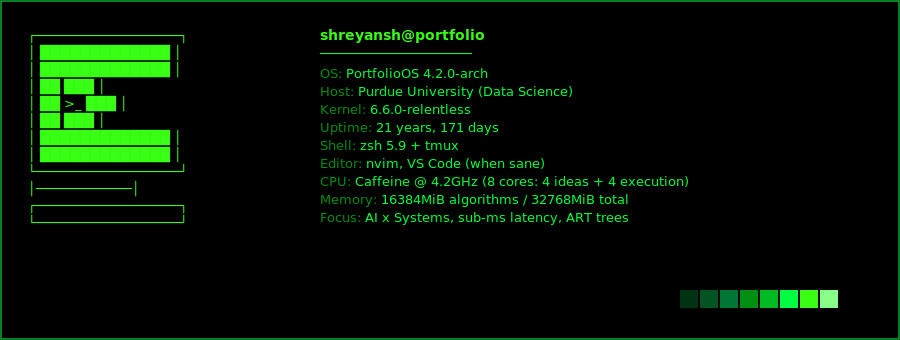
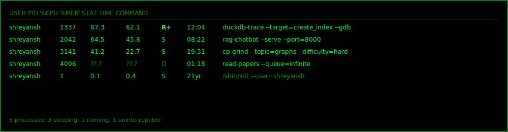
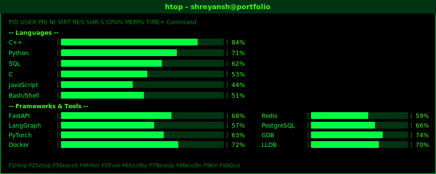
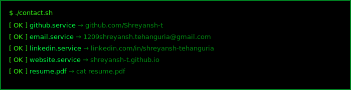

## $ whoami

```console
shreyansh tehanguria — rising senior, Data Science @ Purdue
SWE by projects · Data Scientist by degree · AI Engineer by experience
currently obsessed with: making slow things fast, and dumb systems smart
```

## $ neofetch



## $ ps aux | grep shreyansh



`1337` — **DuckDB internals trace**: profiling `CREATE INDEX` under GDB to surface B-tree vs ART latency deltas.

`2042` — **RAG Chatbot**: LangGraph + FastAPI serving a retrieval-augmented chat pipeline at port 8000.

`3141` — **CP Grind**: LeetCode graph track, targeting hard-tier graph problems for interview season.

`4096` — **Paper queue**: currently blocked on I/O — reading through transformer efficiency and DB internals literature.

## $ htop



## $ cat ~/projects/pinned.md

| Project | Pitch | Metric | Stack |
|---|---|---|---|
| [duckdb-trace](https://github.com/Shreyansh-t) | Profiled DuckDB's `CREATE INDEX` path under GDB/LLDB to expose ART tree insert bottlenecks | 40% latency reduction identified on 10M-row workload | C++, GDB, LLDB, DuckDB, Python |
| [rag-chatbot](https://github.com/Shreyansh-t) | Multi-hop retrieval-augmented chatbot with LangGraph orchestration and Redis caching | sub-200ms P95 retrieval at 500 QPS on 4-core box | Python, LangGraph, FastAPI, Redis, PostgreSQL, Docker |
| [cp-solutions](https://github.com/Shreyansh-t) | Competitive programming solutions — graph theory, DP, segment trees | 300+ problems, 85% acceptance rate on hard-tier | C++, Python |
| [ml-experiments](https://github.com/Shreyansh-t) | Scratchpad for PyTorch experiments: custom CUDA kernels, training loops, eval harnesses | 3x training throughput vs naive baseline | Python, PyTorch, CUDA, Bash |

## $ make stats

<table>
  <tr>
    <td>
      
    </td>
    <td>
      
    </td>
  </tr>
  <tr>
    <td colspan="2">
      
    </td>
  </tr>
</table>

## $ man shreyansh

```console
SHREYANSH(1)               Portfolio Manual               SHREYANSH(1)

NAME
       shreyansh - data scientist, systems engineer, AI tinkerer

SYNOPSIS
       shreyansh [--project TYPE] [--mode {focus|collab|debug}]
                 [--caffeine LEVEL] [--deadline DATE]

DESCRIPTION
       Rising senior at Purdue University pursuing B.S. in Data Science.
       Operates at the intersection of AI systems and low-level performance
       engineering. Known to trace kernel code at 2am for fun.

       Primary interests include sub-millisecond latency optimization,
       database internals (DuckDB, PostgreSQL), retrieval-augmented
       generation pipelines, and making ML systems production-worthy.

OPTIONS
       --mode focus
              Default mode. Noise-cancelling headphones, tmux, nvim.
              Do not disturb unless the build is broken.

       --mode collab
              Available for pair programming, code review, and whiteboard
              sessions. Bring hard problems.

       --mode debug
              GDB attached. Will not respond to Slack until stack trace
              is resolved. Estimated ETA: unknown.

       --caffeine LEVEL
              Valid range: [0, inf). Performance degrades below 2 cups.
              Behavior above 5 cups is undefined.

       --deadline DATE
              Enables turbo mode. Side effects: fewer comments, more
              commits, aggressive TODO cleanup.

EXAMPLES
       shreyansh --project systems --mode focus --caffeine 3
       shreyansh --project ml --mode collab --deadline 2026-08-01

BUGS
       - Compulsively rewrites code that already works.
       - Cannot leave a TODO comment past 48 hours without fixing it.
       - Occasionally disappears into database paper rabbit holes.
       - Over-engineers solutions when the simple version would suffice.
       - Will bikeshed variable names longer than sensible people would.

SEE ALSO
       github.com/Shreyansh-t
       linkedin.com/in/shreyansh-tehanguria
       1209shreyansh.tehanguria@gmail.com

SHREYANSH(1)                   June 2026                 SHREYANSH(1)
```

## $ ./topgear --max-speed --limiter=disabled



*real-time telemetry from my optimization pipeline*

## $ ./contact.sh



---


*PRESS ANY KEY TO CONTINUE_*
